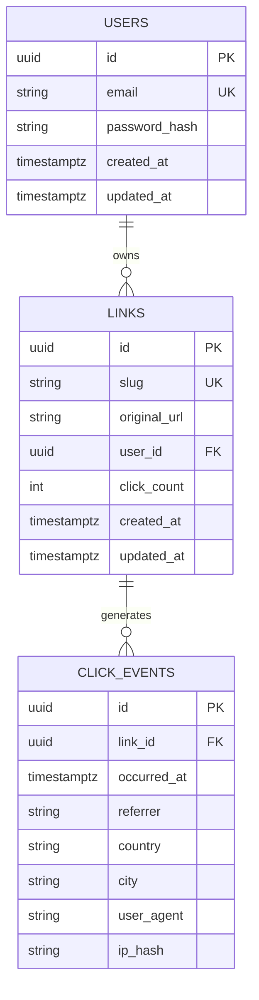

# Architecture

A deeper look at how Linklytics is put together, and the decisions behind it.
For run instructions and the infrastructure tradeoffs writeup, see the
[README](README.md).

## System overview

Four services, coordinated by an ingress:

- **web** (Next.js 15) — the dashboard and auth UI. Client components fetch the
  API directly from the browser with `credentials: include`; middleware gates
  `/dashboard` on the presence of the session cookie.
- **api** (NestJS) — auth, links, redirect, analytics, health. The source of
  truth for authorization; the web app's middleware check is only a convenience.
- **postgres** — durable store for users, links, and click events.
- **redis** — slug→URL cache, click counters, and rate-limit windows.

## Data model

`click_events` is append-only and drives every analytics aggregation. `links`
also keeps a denormalized `click_count` for cheap list rendering. Deleting a user
cascades to links, and a link to its click events.

## API module map

| Module            | Responsibility                                                                   |
| ----------------- | -------------------------------------------------------------------------------- |
| `ConfigModule`    | Loads env, validates it with Zod (`validateEnv`), fails fast on bad config       |
| `PrismaModule`    | Global `PrismaService` (connect on init, disconnect on shutdown)                 |
| `RedisModule`     | Global `RedisService` (ioredis client + cache/counter/window helpers)            |
| `AuthModule`      | register / login / logout / me; bcryptjs; JWT cookie; `JwtAuthGuard`             |
| `LinksModule`     | Owner-scoped CRUD; collision-safe slug; writes the Redis cache; `RateLimitGuard` |
| `RedirectModule`  | `GET /r/:slug` → Redis→Postgres resolve, async click recording, `302`            |
| `AnalyticsModule` | Time series (raw SQL `date_trunc`), top referrers, geo (Prisma `groupBy`)        |
| `HealthModule`    | `/healthz` (liveness), `/readyz` (Postgres + Redis readiness)                    |

Cross-cutting pieces live in `src/common`: the two guards, the `@CurrentUser`
and `@RateLimit` decorators, and small utilities (slug, IP hash, duration).

## Key flows

**Auth.** Passwords are hashed with bcryptjs (cost from `BCRYPT_COST`). Login
issues a JWT signed with `JWT_SECRET`, set as an httpOnly `SameSite=Lax` cookie.
`JwtAuthGuard` reads the cookie, verifies the token, and attaches `{ id, email }`
to the request. Because the cookie is host-scoped (port-independent), the web app
(`:3000`) and API (`:3001`) share it on `localhost`, and they share an origin
behind the k8s ingress.

**Redirect & caching.** `RedirectService` looks up `slug:<slug>` in Redis (a JSON
`{ id, url }`), falling back to a Postgres `findUnique` and re-populating the cache
with a 1h TTL. The 302 is returned immediately; click recording
(`ClickRecorderService`) runs fire-and-forget: it resolves geo from the IP
(`geoip-lite`), stores a **salted SHA-256 of the IP** (never the raw address),
inserts the `click_event`, increments `links.click_count` in a transaction, and
bumps a Redis counter.

**Rate limiting.** `RateLimitGuard` is a Redis fixed-window limiter keyed by user
id (when authenticated) or client IP. Limits for the `create` and `redirect`
buckets come from env (`RATE_LIMIT_*_PER_MIN`); `Express trust proxy` is enabled
so the IP is correct behind the ingress.

**Analytics.** The time series uses a parameterized raw query
(`date_trunc('day', occurred_at)`); referrers and geo use Prisma `groupBy` and are
sorted/sliced in app code to avoid `groupBy` ordering quirks. Every analytics
request re-checks link ownership and 404s for links the caller does not own.

## Deployment topology

`deploy/k8s/base` is environment-agnostic; overlays specialize it:

- **local** — 1 replica each, `:local` image tags loaded into `kind`, no TLS,
  `secretGenerator` from a gitignored `secret.env`.
- **prod** (documented placeholder) — GHCR image references, 3 replicas, TLS via
  cert-manager, `Secure` cookies and HTTPS origins.

Postgres is a `StatefulSet` with a `PVC` and a headless `Service`; the others are
`Deployment` + `ClusterIP`. The API has an `HPA` (CPU) and a non-root
`securityContext`. NetworkPolicies default-deny ingress and allow only the needed
flows (note: `kind`'s default CNI does not _enforce_ them — they are declarative).

## Decision log (ADRs)

### ADR-001 — Public redirect at `/r/:slug`

**Decision.** Serve redirects at `/r/:slug`; the ingress routes `/` → web,
`/api` and `/r` → api. **Tradeoff:** production would use a separate short apex
domain to isolate the redirect hot path; one host keeps the demo `$0` and
single-ingress. Documented in `overlays/prod`.

### ADR-002 — `bcryptjs` over native `bcrypt`

Pure-JS hashing (cost 12) avoids a node-gyp toolchain on both Windows dev
machines and Alpine images. Same algorithm and work factor.

### ADR-003 — Offline geo via `geoip-lite`

Bundled database, no API key, no network call on the hot path, `$0`. Coarser than
a paid MaxMind feed; fine for aggregates.

### ADR-004 — NestJS 10 / Express 4

Chosen over Nest 11 / Express 5 to avoid the `path-to-regexp` v8 wildcard
breaking changes during the build, keeping the toolchain on a well-trodden path.

### ADR-005 — Testcontainers locally, service containers in CI

The integration harness prefers Testcontainers so `pnpm test` is self-contained
(just needs Docker). When `TEST_DATABASE_URL` + `TEST_REDIS_URL` are set it uses
those instead — which is exactly how CI wires up Postgres/Redis service
containers. One codebase, two execution environments.

### ADR-006 — API self-migrates on startup

The API image bundles the Prisma CLI and runs `prisma migrate deploy` from its
entrypoint before starting. `migrate deploy` takes an advisory lock, so the two
replicas serialize safely. Simpler than a separate migration Job for a demo; a
larger system would split migrations into their own pipeline step.
