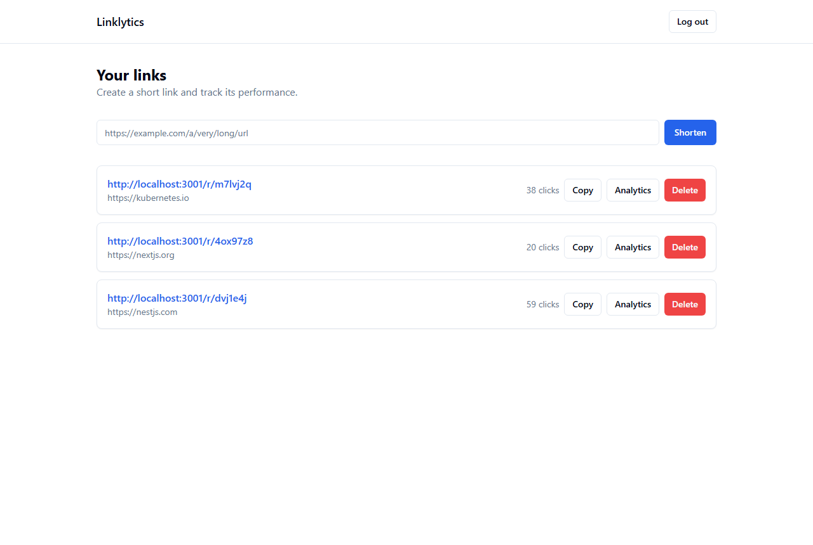
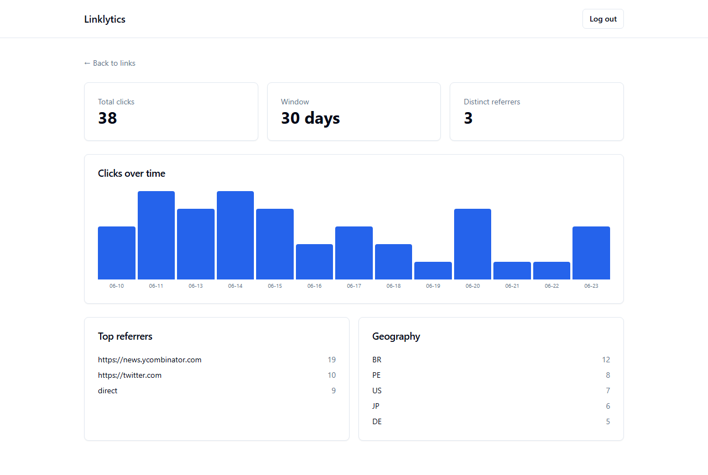
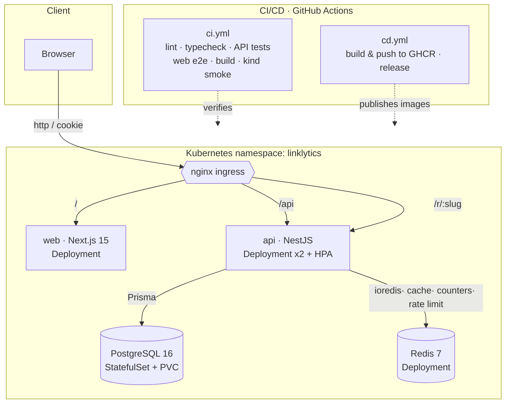
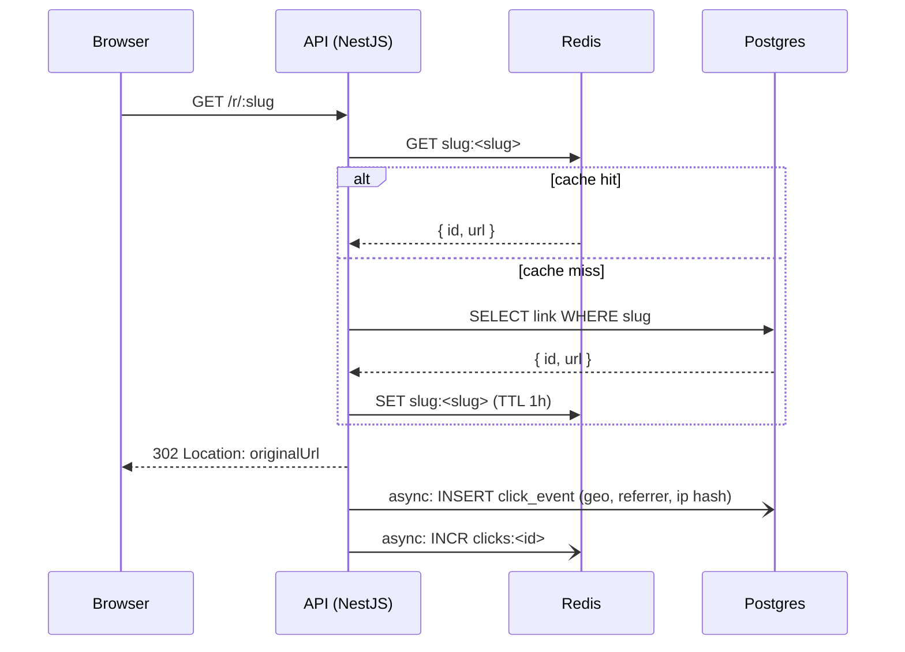

# Linklytics

> A self-hostable **URL shortener with click analytics**, built as a
> production-shaped, **$0-to-run** full-stack platform: Next.js + NestJS,
> PostgreSQL + Redis, containerized with Docker, orchestrated on **local
> Kubernetes (`kind`)**, with a CI/CD pipeline that **smoke-tests the whole
> deployment end-to-end**.

Create short links, share them, and watch the clicks roll in — time series, top
referrers and geography per link.





<sub>Regenerate with the stack running + demo data seeded: `node apps/web/scripts/capture-screenshots.mjs`.</sub>

---

## Contents

- [Features](#features)
- [Architecture](#architecture)
- [Tech stack & why](#tech-stack--why)
- [Repository layout](#repository-layout)
- [Run locally (Docker Compose)](#run-locally-docker-compose)
- [Run on Kubernetes (kind)](#run-on-kubernetes-kind)
- [Testing](#testing)
- [CI/CD overview](#cicd-overview)
- [Infrastructure tradeoffs](#infrastructure-tradeoffs)
- [Security & quality](#security--quality)
- [Design decision: redirects at `/r/:slug`](#design-decision-redirects-at-rslug)

## Features

- **Auth** — register / login / logout / me, bcrypt (cost 12), JWT in an
  httpOnly `SameSite=Lax` cookie, route guard.
- **Links** — owner-scoped CRUD, collision-safe slug generation, copy-to-clipboard.
- **Redirects** — `GET /r/:slug` resolves via Redis (cache) with a Postgres
  fallback, records a click asynchronously, and returns `302`.
- **Analytics** — clicks over time, top referrers, and geography (offline IP→geo).
- **Ops** — `/healthz` liveness, `/readyz` readiness (checks Postgres + Redis),
  Prometheus `/metrics`, Helmet, CORS whitelist, Redis-backed rate limiting on
  create + redirect.

## Architecture



Redirect request flow (cache-first, async click recording):



More detail and the decision log live in [ARCHITECTURE.md](ARCHITECTURE.md).

## Tech stack & why

| Layer         | Choice                                        | Why                                                                          |
| ------------- | --------------------------------------------- | ---------------------------------------------------------------------------- |
| Web           | Next.js 15 (App Router), TS strict, Tailwind  | Modern React, server/client split, fast DX; standalone output → tiny image   |
| API           | NestJS, TS strict, Prisma                     | Opinionated modular structure, DI, decorators map cleanly to this domain     |
| Validation    | class-validator (DTOs) + Zod (env, fail-fast) | Trust nothing from the client; refuse to boot on bad config                  |
| Data          | PostgreSQL 16, Redis 7                        | Relational integrity for links/clicks; Redis for cache, counters, rate limit |
| Containers    | Multi-stage Docker, non-root, slim runtime    | Reproducible, small, least-privilege images                                  |
| Orchestration | Kubernetes via Kustomize (base + overlays)    | Declarative infra, probes, HPA, rollouts, network policy — production-shaped |
| Local cluster | `kind`                                        | A real Kubernetes API on a laptop, $0, no cloud                              |
| CI/CD         | GitHub Actions                                | Tests + builds + **end-to-end kind smoke test** + GHCR publish               |

Two deliberate substitutions, documented as ADRs in
[ARCHITECTURE.md](ARCHITECTURE.md): **`bcryptjs`** (pure-JS, no native build on
Windows or Alpine) and **`geoip-lite`** (offline IP→geo, no API key).

## Repository layout

```
apps/
  api/      NestJS API (Prisma, Redis, auth, links, redirect, analytics, health)
  web/      Next.js 15 web app (auth, dashboard, analytics)
deploy/
  compose/  docker-compose.yml — full local stack
  k8s/      Kustomize base + overlays/{local,prod} + kind-config.yaml
.github/workflows/  ci.yml, cd.yml
scripts/    k8s-up.mjs, k8s-down.mjs, smoke.sh
Makefile    task runner (with Windows-friendly pnpm script equivalents)
```

## Run locally (Docker Compose)

**Prerequisites:** Docker (Desktop with the WSL2 backend on Windows).

```bash
# from the repo root
make up           # or: pnpm compose:up
```

This builds and starts **postgres + redis + api + web**. The API applies its
Prisma migrations on startup.

- Web: <http://localhost:3000>
- API health: <http://localhost:3001/healthz> · readiness: `/readyz`

Seed demo data (optional) and tear down:

```bash
make seed         # demo account: demo@linklytics.dev / demopassword123
make down         # or: pnpm compose:down   (also removes volumes)
```

> **Windows without `make`?** Every target has a `pnpm` equivalent —
> `pnpm compose:up`, `pnpm compose:down`, `pnpm k8s:up`, `pnpm k8s:down`.

## Run on Kubernetes (kind)

**Prerequisites:** Docker, [`kind`](https://kind.sigs.k8s.io/), `kubectl`.

```bash
make k8s-up       # or: pnpm k8s:up
```

This will (see [`scripts/k8s-up.mjs`](scripts/k8s-up.mjs)):

1. create a `kind` cluster with ingress port mappings,
2. install the nginx ingress controller,
3. build the `api` and `web` images and `kind load` them (no registry),
4. `kubectl apply -k deploy/k8s/overlays/local`,
5. wait for every rollout.

Then everything is served on a single host through the ingress:

- Web: <http://localhost/>
- API (through ingress): `http://localhost/api/...`, redirects at `http://localhost/r/:slug`

Tear down:

```bash
make k8s-down     # or: pnpm k8s:down
```

## Testing

```bash
make test         # lint + typecheck + API tests + web e2e (brings the stack up)
```

- **API** — Jest + Supertest integration tests cover auth, owner-scoped link
  CRUD, the redirect (cache hit / DB hit / 404), rate limiting, and analytics
  aggregations, with a **70% line-coverage gate**. Locally the suite spins up
  **Testcontainers** (Postgres + Redis); in CI it uses service containers via
  the `TEST_DATABASE_URL` / `TEST_REDIS_URL` override — one harness, two paths.
- **Web** — a Playwright e2e drives the critical flow: register → create a link
  → see it listed → open its analytics.

## Observability

The API exposes Prometheus metrics at `/metrics`: default Node/process metrics, a
request-latency histogram (`http_request_duration_seconds`), and domain counters
(`linklytics_redirects_total{result}`, `linklytics_clicks_recorded_total`). One
command brings up the stack wired to Prometheus + Grafana with a provisioned
dashboard:

```bash
make obs-up        # or: pnpm compose:obs
```

- Grafana — <http://localhost:3002> (admin / admin), the "Linklytics overview" dashboard
- Prometheus — <http://localhost:9090>

In Kubernetes the metrics are scraped in-cluster (the endpoint is not exposed
through the ingress).

## CI/CD overview

**`ci.yml`** (every push / PR):

| Job              | What it proves                                                      |
| ---------------- | ------------------------------------------------------------------- |
| `quality`        | ESLint + strict `tsc` pass on both apps                             |
| `api-tests`      | Integration suite green against Postgres + Redis service containers |
| `web-e2e`        | Playwright critical-flow passes against the compose stack           |
| `build-images`   | Both Docker images build (no push), with layer caching              |
| **`kind-smoke`** | **The differentiator** — see below                                  |

The **kind smoke test** stands up a real Kubernetes cluster _inside the runner_,
loads the freshly built images, applies `overlays/local`, waits for rollouts,
and then runs [`scripts/smoke.sh`](scripts/smoke.sh) to assert the web returns
`200`, a `/r/:slug` returns `302` to its target through the ingress, and the API
`/readyz` reports healthy. **This proves the pipeline _and_ the Kubernetes
manifests work together, end-to-end** — not just that the code compiles.

**`cd.yml`** (push to `main`, `v*` tags): builds and pushes both images to
`ghcr.io` (tags = short SHA + semver on tags + `latest` on the default branch),
cuts a GitHub release with generated notes on tags, and runs a **documented
placeholder** deploy step that renders `overlays/prod` (no paid cloud cluster is
provisioned — the whole project runs on local `kind`).

## Infrastructure tradeoffs

This section exists to be defensible in an interview — the honest "when would
you _not_ do this".

- **Why Kubernetes here?** To demonstrate production-shaped orchestration:
  declarative manifests, liveness/readiness probes, horizontal autoscaling,
  rolling updates, a StatefulSet with persistent storage, and zero-trust
  NetworkPolicies. It coordinates four services with self-healing and
  independent scaling.
- **When would I _not_ use it?** For an app at _this_ actual scale, I wouldn't.
  A single VM with Docker Compose, or a PaaS (Render, Railway, Fly.io), is
  cheaper and far less operational overhead. Kubernetes earns its complexity at
  multi-service, multi-team, or real-traffic scale — below that it is mostly
  YAML and a control plane to babysit.
- **Compose vs. Kubernetes.** They target different stages, so the repo ships
  both: Compose for fast local iteration (one file, one command), Kubernetes for
  orchestration concerns (scaling, rollouts, self-healing, network policy). The
  compose stack is also what the web e2e runs against in CI.
- **Single container vs. orchestration.** One all-in-one container is the
  simplest possible deploy, but it couples the lifecycle and scaling of web,
  api, and data. Splitting them lets each scale and fail independently — the
  point of the orchestration layer.
- **`kind` vs. a managed cluster.** `kind` gives a real Kubernetes API for `$0`
  and makes the smoke test reproducible on any machine and in CI. It is not a
  production target: a managed cluster (EKS/GKE/AKS) would add real load
  balancers, storage classes, and an ingress with TLS — sketched in
  `overlays/prod`.

## Security & quality

- bcrypt cost 12; JWT in an httpOnly `SameSite=Lax` cookie; CORS whitelist;
  Helmet; Redis fixed-window rate limiting on create + redirect.
- Server-side DTO validation (`class-validator`) — the client is never trusted.
- Zod validates environment variables at boot and **fails fast** on bad config.
- No secrets in the repo: `.env.example` everywhere, Kustomize `secretGenerator`
  reads a gitignored `secret.env`. Click events store a **salted hash of the IP**,
  never the raw address.
- ESLint + Prettier + `tsconfig` strict across both apps.

## Design decision: redirects at `/r/:slug`

The dashboard owns `/`, so the public redirect lives at `/r/:slug` to avoid
shadowing app routes and static assets. The ingress routes `/` → web and
`/api` + `/r` → api.

**Tradeoff:** a real shortener serves redirects from a short, separate apex
domain (e.g. `https://lnk.example/abc123`) for branding and to isolate the
redirect hot path from the app. Running everything on one host keeps the local
demo to `$0` and a single ingress; the `overlays/prod` overlay documents the
separate-domain / TLS path.

## License

[MIT](LICENSE).
